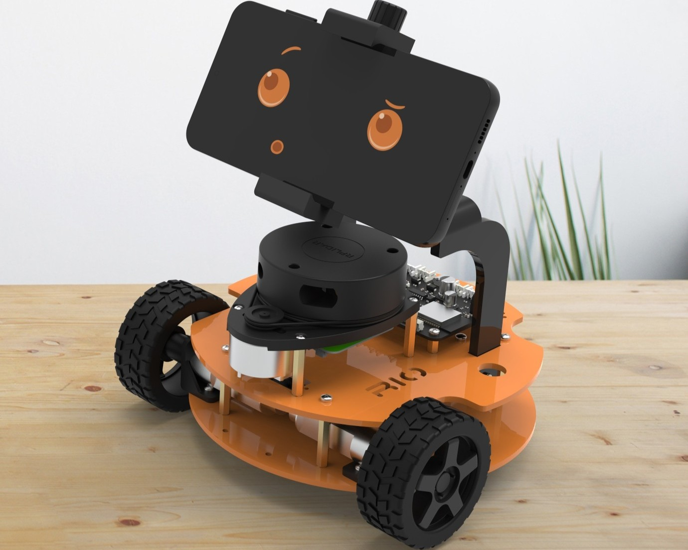

    

    
    
    
    
    
    
    
    
    

    <h1 align="center">RIO Hardware</h1>

    

## Description
This repository contains the Bill of Materials (BOM) for the RIO robot hardware parts and assembly. The RIO project aims to transform your smartphone into a fully-featured ROS2 robot, utilizing a wide array of built-in mobile sensors and custom hardware. The hardware design includes a custom PCB, motor drivers, and sensor integrations that work seamlessly with the RIO mobile app and ROS2 ecosystem.

## Related Repositories
- 🔧 [RIO Firmware](https://github.com/botforge-robotics/rio_firmware/tree/main) - ESP32 firmware for the RIO PCB
- 🤖 [RIO ROS2](https://github.com/botforge-robotics/rio_ros2) - ROS2 packages for navigation, control, and sensor integration

# Bill of Materials

## Hardware Components
| No | Part Name | Description | Store | Quantity | Amount | Purchase Link |
|----|-----------|-------------|--------|----------|---------|---------------|
| 1  | Dc-Motors with Encoders | TT Motor N20 12V 125RPM | Robu | 2 | ₹ 940 | [Link](https://robu.in/product/n20-12v-125rpm-metal-gear-motor-with-encoder-d-type-shaft/) |
| 2  | Wheels    | 65mm Rubber Tyre Wheels | Robu | 2 | ₹ 330 | [Link](https://robu.in/product/65mm-robot-smart-car-12-rim-wheel-silver/) |
| 3  | Wheel Couplers | Short Coupling for Robot Smart Car Wheel | Robu | 2 | ₹ 160 | [Link](https://robu.in/product/short-coupling-for-robot-smart-car-wheel-4-mm-length-18mm/) |
| 4  | Caster Wheels | 30mm Dia and 37mm Height | Robu | 1 | ₹ 50 | [Link](https://robu.in/product/smart-car-wheel-trace-robot-patrol-line-vehicle) |
| 5  | Battery   | 7.4V 2500mAh 3C Li-ion | Robu | 1 | ₹ 520 | [Link](https://robu.in/product/orange-18650-li-ion-2500mah-7-4v-2s1p-protected-battery-pack-3c) |
| 6  | Charger   | 8.4V 1A Charger | Robu | 1 | ₹ 580 | [Link](#https://robu.in/product/lithium-battery-charger-8-4v-1a-with-dc-plug-2-indicators) |
| 7  | Lidar RP A1m8 | SLAMTECH RPLIDAR A1m8 | Robu | 1 | ₹ 8500 | [Link](https://robu.in/product/rp-lidar-a1m8-360-degrees-laser-range-finder) |
| 8  | Voltage Meter | 2S 18650 Li-Po Lithium Battery Capacity Indicator Module | Robu | 1 | ₹ 95 | [Link](https://robu.in/product/2s-18650-li-po-lithium-battery-capacity-indicator-module) |
| 9  | DC Jack For Voltage Meter | DC Jack Connector Male 2.1mm x 5.5mm with Wire | Robu | 1 | ₹ 45 | [Link](https://robu.in/product/dc-jack-connector-male-2-1mm-x-5-5mm-with-wire) |
| 10 | RGB LED   | WS2812B LED Breakout Board | Robu | 2 | ₹ 30 | [Link](https://robu.in/product/cjmcu-123-ws2811-rgb-led-breakout-module) |
| 11 | Standoff MF Plastic M3 | 30mm Length | Robu | 4 | ₹ 35 | [Link](https://robu.in/product/m330mm-male-to-female-nylon-hex-spacer-10pcs) |
| 12 | Standoff MF Plastic M3 | 15mm Length | Robu | 4 | ₹ 24 | [Link](https://robu.in/product/m315mm-male-to-female-nylon-hex-spacer-10pcs) |
| 13 | Standoff MF Plastic M3 | 10mm Length | Robu | 4 | ₹ 25 | [Link](https://robu.in/product/m310mm-male-to-female-nylon-hex-spacer-10pcs-copy) |
| 14 | M3 Bolt Phillips | 6mm Length | Omrook | 8 | ₹ 5| [Link](https://omrook.com/fasteners/machine-screw/phillips-screw-with-washer/m3x6mm-phillip-with-washer-dia-3mm-length-6mm-machine-screw/) |
| 15 | M3 Bolt Phillips | 10mm Length | Omrook | 20 | ₹ 15 | [Link](https://omrook.com/fasteners/machine-screw/phillips-screw-with-washer/m3x10mm-phillip-with-washer-dia-3mm-length-10mm-machine-screw/) |
| 16 | M2.5 Bolt Phillips | 12mm Length | Omrook | 8 | ₹ 5 | [Link](https://omrook.com/fasteners/machine-screw/combi-head-screw/combi-screw-m2-5-x-12mm-screw-diameter-2-5mm-length-12mm/) |
| 17 | M3 Nuts   | Nylock | Omrook | 20 | ₹ 25 | [Link](https://omrook.com/fasteners/nut/nyloc-nut/3mm-nyloc-nut-m3/) |
| 18 | Mobile Mount | Mobile Holder with Adjustable Clamp | Amazon | 1 | ₹ 195 | [Link](https://www.amazon.in/gp/product/B08W1KX225/ref=ppx_yo_dt_b_asin_title_o02_s01?ie=UTF8&th=1) |
| 19 | Mobile Ball Joint | Universal 1/4" Screw Swivel Ball Head Tripod Mount | Amazon | 1 | ₹ 200 | [Link](https://www.amazon.in/gp/product/B0BCFPNFCF/ref=ppx_yo_dt_b_asin_title_o02_s00?ie=UTF8&th=1) |
| 20 | Chassis   | Laser Cutting(or)3D Printed Parts | - | - | ₹ 300 | [Link](#) |
| 21 | PCB       | Custom PCB | Botforge | 1 | ₹ 2499 | [Link](#) |

## Software
| Component | Description | Store | License | Cost | Link |
|-----------|-------------|--------|---------|---------| ---------|
| **RIO Mobile App** | Android application for robot control and sensor integration | Play Store | Single User | ₹ 999  | [Link](#) |

> Note: The RIO Mobile App is not a required component for operating the robot, but it enables the use of smartphone sensors and transforms your robot into a companion robot with advanced features.

### 💰 Total Cost: ₹ 15,577/-

