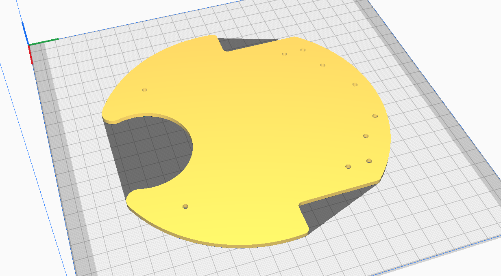
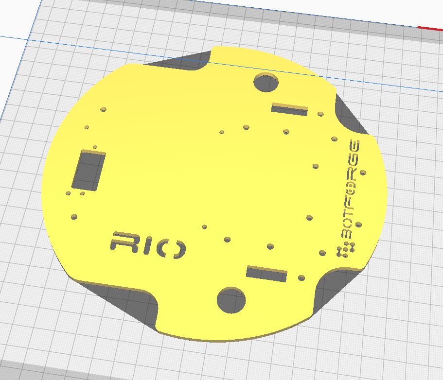
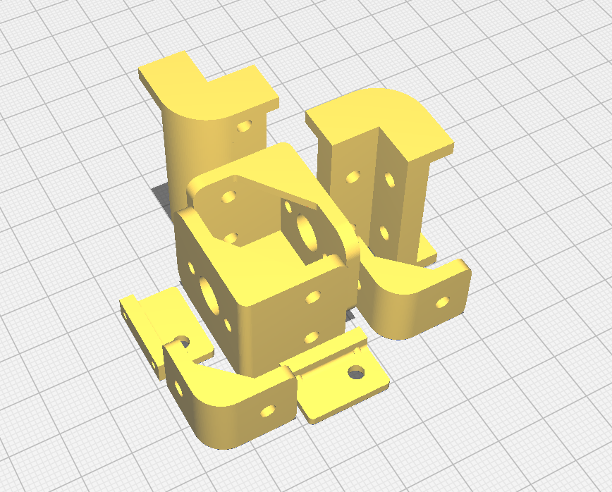
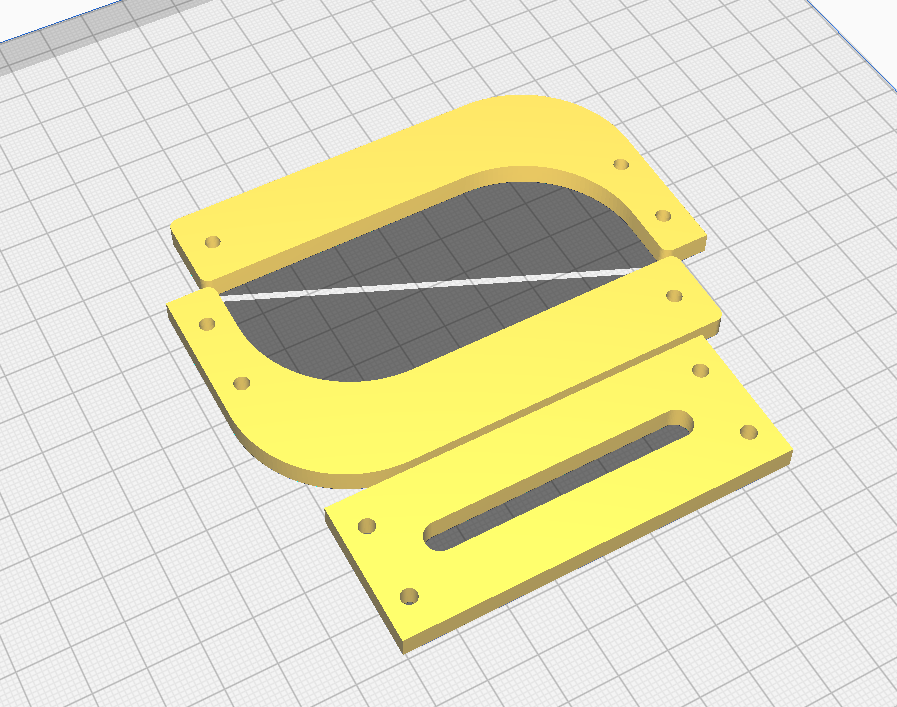
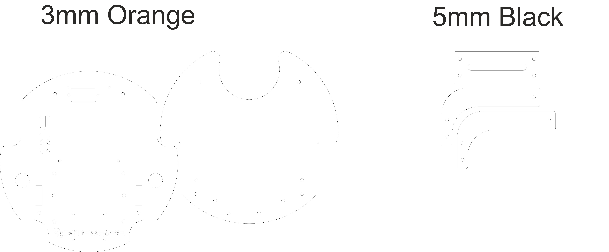

    

    
    
    
    
    
    
    
    
    

    <h1 align="center">RIO Hardware</h1>

    

## Table of Contents
- [Bill of Materials](#bill-of-materials)
  - [Hardware Components](#hardware-components)
  - [Software](#software)
    - [💰 Total Cost: ~₹15,777/-](#-total-cost-15777-)
  - [Fabrication Options](#fabrication-options)
    - [Option 1: Full 3D Printing](#option-1-full-3d-printing)
    - [Option 2: Hybrid (Recommended)](#option-2-hybrid-recommended)
  - [Related Repositories](#related-repositories)
  - [🤝 Contributing](#-contributing)

## Description
This repository contains the Bill of Materials (BOM) for the RIO robot hardware parts and assembly. The RIO project aims to transform your smartphone into a fully-featured ROS2 robot, utilizing a wide array of built-in mobile sensors and custom hardware. The hardware design includes a custom PCB, motor drivers, and sensor integrations that work seamlessly with the RIO mobile app and ROS2 ecosystem.

# Bill of Materials

## Hardware Components
| No | Part Name | Description | Store | Quantity | Amount | Purchase Link |
|----|-----------|-------------|--------|----------|---------|---------------|
| 1  | Dc-Motors with Encoders | TT Motor N20 12V 125RPM | Robu | 2 | ₹940 | [Link](https://robu.in/product/n20-12v-125rpm-metal-gear-motor-with-encoder-d-type-shaft/) |
| 2  | Wheels    | 65mm Rubber Tyre Wheels | Robu | 2 | ₹330 | [Link](https://robu.in/product/65mm-robot-smart-car-12-rim-wheel-silver/) |
| 3  | Wheel Couplers | Short Coupling for Robot Smart Car Wheel | Robu | 2 | ₹160 | [Link](https://robu.in/product/short-coupling-for-robot-smart-car-wheel-4-mm-length-18mm/) |
| 4  | Caster Wheels | 30mm Dia and 37mm Height | Robu | 1 | ₹50 | [Link](https://robu.in/product/smart-car-wheel-trace-robot-patrol-line-vehicle) |
| 5  | Battery   | 7.4V 2500mAh 3C Li-ion | Robu | 1 | ₹520 | [Link](https://robu.in/product/orange-18650-li-ion-2500mah-7-4v-2s1p-protected-battery-pack-3c) |
| 6  | Charger   | 8.4V 1A Charger | Robu | 1 | ₹580 | [Link](#https://robu.in/product/lithium-battery-charger-8-4v-1a-with-dc-plug-2-indicators) |
| 7  | Lidar RP A1m8 | SLAMTECH RPLIDAR A1m8 | Robu | 1 | ₹8500 | [Link](https://robu.in/product/rp-lidar-a1m8-360-degrees-laser-range-finder) |
| 8  | Voltage Meter | 2S 18650 Li-Po Lithium Battery Capacity Indicator Module | Robu | 1 | ₹95 | [Link](https://robu.in/product/2s-18650-li-po-lithium-battery-capacity-indicator-module) |
| 9  | DC Jack For Voltage Meter | DC Jack Connector Male 2.1mm x 5.5mm with Wire | Robu | 1 | ₹45 | [Link](https://robu.in/product/dc-jack-connector-male-2-1mm-x-5-5mm-with-wire) |
| 10 | RGB LED   | WS2812B LED Breakout Board | Robu | 2 | ₹30 | [Link](https://robu.in/product/cjmcu-123-ws2811-rgb-led-breakout-module) |
| 11 | Standoff MF Plastic M3 | 30mm Length | Robu | 4 | ₹35 | [Link](https://robu.in/product/m330mm-male-to-female-nylon-hex-spacer-10pcs) |
| 12 | Standoff MF Plastic M3 | 15mm Length | Robu | 4 | ₹24 | [Link](https://robu.in/product/m315mm-male-to-female-nylon-hex-spacer-10pcs) |
| 13 | Standoff MF Plastic M3 | 10mm Length | Robu | 4 | ₹25 | [Link](https://robu.in/product/m310mm-male-to-female-nylon-hex-spacer-10pcs-copy) |
| 14 | M3 Bolt Phillips | 6mm Length | Omrook | 8 | ₹5| [Link](https://omrook.com/fasteners/machine-screw/phillips-screw-with-washer/m3x6mm-phillip-with-washer-dia-3mm-length-6mm-machine-screw/) |
| 15 | M3 Bolt Phillips | 10mm Length | Omrook | 20 | ₹15 | [Link](https://omrook.com/fasteners/machine-screw/phillips-screw-with-washer/m3x10mm-phillip-with-washer-dia-3mm-length-10mm-machine-screw/) |
| 16 | M2.5 Bolt Phillips | 12mm Length | Omrook | 8 | ₹5 | [Link](https://omrook.com/fasteners/machine-screw/combi-head-screw/combi-screw-m2-5-x-12mm-screw-diameter-2-5mm-length-12mm/) |
| 17 | M3 Nuts   | Nylock | Omrook | 20 | ₹25 | [Link](https://omrook.com/fasteners/nut/nyloc-nut/3mm-nyloc-nut-m3/) |
| 18 | Mobile Mount | Mobile Holder with Adjustable Clamp | Amazon | 1 | ₹195 | [Link](https://www.amazon.in/gp/product/B08W1KX225/ref=ppx_yo_dt_b_asin_title_o02_s01?ie=UTF8&th=1) |
| 19 | Mobile Ball Joint | Universal 1/4" Screw Swivel Ball Head Tripod Mount | Amazon | 1 | ₹200 | [Link](https://www.amazon.in/gp/product/B0BCFPNFCF/ref=ppx_yo_dt_b_asin_title_o02_s00?ie=UTF8&th=1) |
| 20 | Chassis   | Laser Cutting(or)3D Printed Parts | - | - | ₹500 | -  |
| 21 | PCB       | Custom PCB | Botforge | 1 | ₹2499 | Comming Soon |

## Software
| Component | Description | Store | License | Cost | Link |
|-----------|-------------|--------|---------|---------| ---------|
| **RIO Mobile App** | Android application for robot control and sensor integration | Play Store | Single User | ₹999  | Comming Soon |

> Note: The RIO Mobile App is not a required component for operating the robot, but it enables the use of smartphone sensors and transforms your robot into a companion robot with advanced features.

### 💰 Total Cost: ~₹15,777/-

---

## Fabrication Options

The RIO robot chassis can be fabricated using either full 3D printing or a hybrid approach combining laser cutting and 3D printing. Here are the details for both options:

### Option 1: Full 3D Printing
All parts are available as STL files in the `3dPrinting` folder:

**Base Components:**
- [`base_bottom.stl`](./3dPrinting/base_bottom.stl) - Bottom plate of the chassis.
- [`base_top.stl`](./3dPrinting/base_top.stl) - Top plate of chasis.
- [`motor_bracket_left.stl`](./3dPrinting/motor_bracket_left.stl) & [`motor_bracket_right.stl`](./3dPrinting/motor_bracket_right.stl) - Motor mounting brackets.

**Mobile Phone Mount:**
- [`mobile_holder_base_top.stl`](./3dPrinting/mobile_holder_base_top.stl) - Top connecting piece
- [`mobile_holder_base_side_left.stl`](./3dPrinting/mobile_holder_base_side_left.stl) & [`mobile_holder_base_side_right.stl`](./3dPrinting/mobile_holder_base_side_right.stl) - Mount side connecting side pieces
- [`mobile_holder_top_bracket_left.stl`](./3dPrinting/mobile_holder_top_bracket_left.stl) & [`mobile_holder_top_bracket_right.stl`](./3dPrinting/mobile_holder_top_bracket_right.stl) - Top connecting brackets
- [`mobile_holder_bracket_left.stl`](./3dPrinting/mobile_holder_bracket_left.stl) & [`mobile_holder_bracket_right.stl`](./3dPrinting/mobile_holder_bracket_right.stl) - Mounting brackets holder to chasis

**LED Holders:**
- [`ws2812b_holder_left.stl`](./3dPrinting/ws2812b_holder_left.stl) & [`ws2812b_holder_right.stl`](./3dPrinting/ws2812b_holder_right.stl) - RGB LED mounting brackets

    
    
    
    

### Option 2: Hybrid (Recommended)
For better durability and professional finish, you can use a combination of laser cutting and 3D printing:

**Laser Cut Parts & Files:**
- Base Components (3mm Acrylic):
  - [`base_bottom_3mm.dxf`](./laserCuting/base_bottom_3mm.dxf) - Bottom plate of the chassis
  - [`base_top_3mm.dxf`](./laserCuting/base_top_3mm.dxf) - Top plate of the chassis

- Mobile Phone Mount (5mm Acrylic):
  - [`mobile_base_top_5mm.dxf`](./laserCuting/mobile_base_top_5mm.dxf) - Top piece
  - [`mobile_base_side_left_5mm.dxf`](./laserCuting/mobile_base_side_left_5mm.dxf) - Left side piece
  - [`mobile_base_side_right_5mm.dxf`](./laserCuting/mobile_base_side_right_5mm.dxf) - Right side piece

- Complete Design File:
  - [`all_files_laser_cutting.cdr`](./laserCuting/all_files_laser_cutting.cdr) - CorelDRAW-v11 format with all components

    

**3D Printed Parts:**
- Motor Mounts:
  - [`motor_bracket_left.stl`](./3dPrinting/motor_bracket_left.stl) - Left motor bracket
  - [`motor_bracket_right.stl`](./3dPrinting/motor_bracket_right.stl) - Right motor bracket

- Mobile Phone Mount Brackets:
  - [`mobile_holder_bracket_left.stl`](./3dPrinting/mobile_holder_bracket_left.stl) - Left mounting bracket
  - [`mobile_holder_bracket_right.stl`](./3dPrinting/mobile_holder_bracket_right.stl) - Right mounting bracket
  - [`mobile_holder_top_bracket_left.stl`](./3dPrinting/mobile_holder_top_bracket_left.stl) - Left top bracket
  - [`mobile_holder_top_bracket_right.stl`](./3dPrinting/mobile_holder_top_bracket_right.stl) - Right top bracket

- LED Holders:
  - [`ws2812b_holder_left.stl`](./3dPrinting/ws2812b_holder_left.stl) & [`ws2812b_holder_right.stl`](./3dPrinting/ws2812b_holder_right.stl) - RGB LED mounting brackets

> Note: The hybrid approach (Option 2) is recommended for better durability and professional appearance. However, full 3D printing is perfectly viable for prototyping or if laser cutting is not available.

## Related Repositories
- 🔧 [RIO Firmware](https://github.com/botforge-robotics/rio_firmware) - RIO Controller Micro-Ros Code
- 🤖 [RIO ROS2](https://github.com/botforge-robotics/rio_ros2) - ROS2 packages for navigation, control, and sensor integration

## 🤝 Contributing
1. Fork the Repository
2. Create Feature Branch
3. Commit Changes
4. Push to Branch
5. Open Pull Request

---